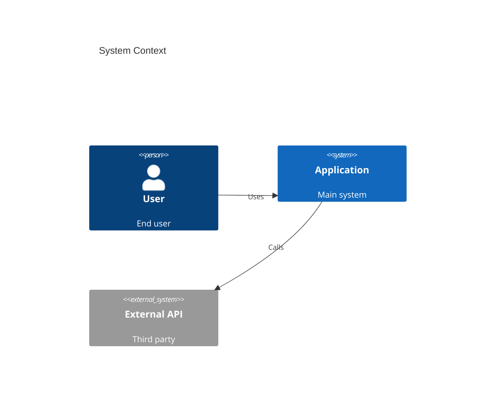
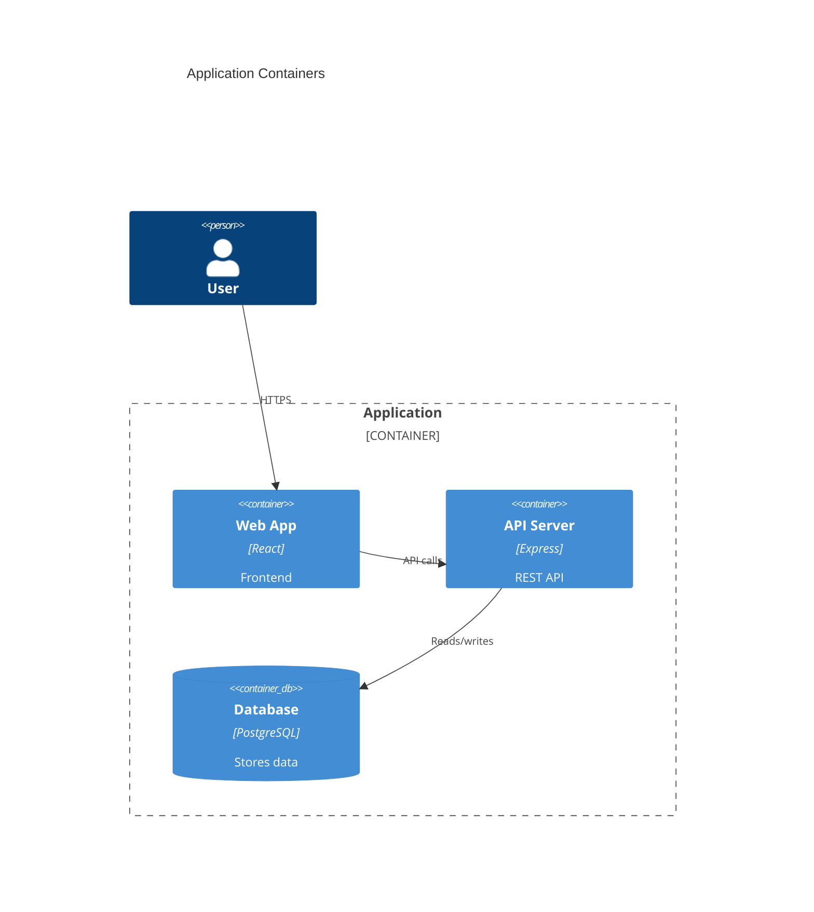
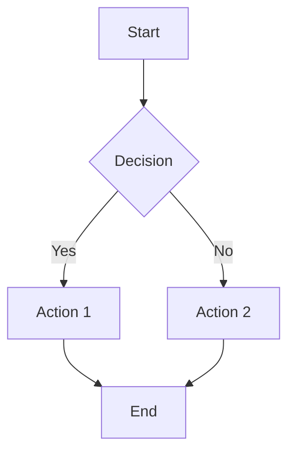
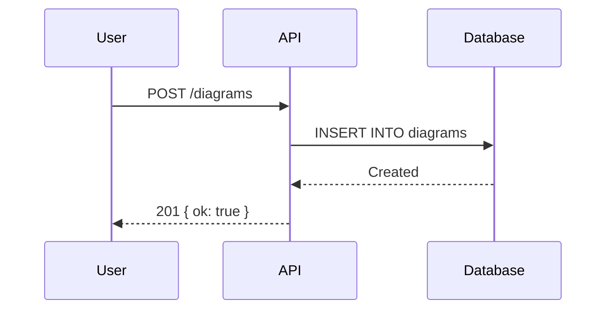

# Draw — Diagram Manager

Create and manage architecture diagrams at `draw.bots.town`.

## API

Base: `http://localhost:3030/api/v1`

### Endpoints

| Method | Path | Description |
|--------|------|-------------|
| GET | `/diagrams` | List all (metadata only) |
| GET | `/diagrams/:slug` | Get full diagram with content |
| POST | `/diagrams` | Create new diagram |
| PATCH | `/diagrams/:slug` | Update diagram (requires `version`) |
| DELETE | `/diagrams/:slug` | Soft delete (requires `version`) |
| POST | `/diagrams/:slug/restore` | Restore deleted diagram |

### Query params (GET /diagrams)
- `?search=` — full-text search on title + description
- `?tags=a,b` — filter by tags (AND logic)
- `?sort=updated_at|created_at|title`
- `?order=asc|desc`
- `?limit=50&offset=0`

### Create (POST /diagrams)
```json
{
  "title": "System Overview",
  "slug": "system-overview",
  "description": "High-level architecture",
  "content": "graph TD\n  A-->B",
  "diagram_type": "mermaid",
  "tags": ["architecture"]
}
```
- `slug` optional (auto-generated from title)
- `title` and `content` required
- Tags must be lowercase alphanumeric + hyphens

### Update (PATCH /diagrams/:slug)
```json
{
  "content": "graph TD\n  A-->B-->C",
  "version": 1
}
```
- `version` is **required** (optimistic locking)
- First GET the diagram to get current version
- Slug is immutable

### Response format
```json
{
  "ok": true,
  "data": {
    "id": "uuid",
    "slug": "system-overview",
    "title": "System Overview",
    "content": "graph TD\n  A-->B",
    "version": 1,
    "tags": ["architecture"],
    "created_at": "...",
    "updated_at": "..."
  }
}
```

## Workflow

### Creating a diagram
1. Generate Mermaid content (see Diagram Types below)
2. POST to `/diagrams`
3. Send user the link: `https://draw.bots.town/d/{slug}`

### Updating a diagram
1. GET `/diagrams/:slug` to get current version
2. PATCH with new content + current version number
3. Tell user to refresh

### Example: Create via curl
```bash
curl -s -X POST http://localhost:3030/api/v1/diagrams \
  -H "Content-Type: application/json" \
  -d '{
    "title": "swap.win Architecture",
    "content": "C4Context\n  title swap.win\n  Person(user, \"User\")\n  System(swap, \"swap.win\", \"DEX aggregator\")",
    "tags": ["architecture", "swap-win"]
  }'
```

## Diagram Types

Use **C4 diagrams** for architecture (preferred). Use **flowcharts** for processes/flows. Use **sequence diagrams** for interactions.

### C4 Context (high-level system overview)


### C4 Container (zoom into a system)


### Flowchart


### Sequence Diagram


## Rules
- Always use `securityLevel: strict` conventions (no HTML in labels)
- **DO NOT use C4 diagram types** — Mermaid's C4 layout is broken for anything complex. Use flowcharts with subgraphs instead.
- **Always use ELK layout engine** — add this frontmatter to every diagram:
  ```
  ---
  config:
    layout: elk
    theme: dark
    elk:
      mergeEdges: true
      nodePlacementStrategy: NETWORK_SIMPLEX
  ---
  ```
- **Use `graph LR`** (left-to-right) for architecture diagrams. Use `graph TB` only for simple flows.
- **Color-code subgroups** with dark fills and colored borders (dark theme friendly):
  - Frontends: `fill:#1a3a2a,stroke:#4caf50`
  - Backend: `fill:#2a2a1a,stroke:#ff9800`
  - Data: `fill:#1a2a3a,stroke:#29b6f6`
  - Indexers/Workers: `fill:#2a1a3a,stroke:#ab47bc`
  - External/Chain: `fill:#3a1a1a,stroke:#ef5350`
- **Use emoji in subgraph labels** for visual scanning (🖥 ⚙️ 💾 🔄 ⛓)
- **Visual hierarchy for links**: solid for main flow, dashed for lookups/queries, thick double for critical paths (on-chain TX)
- **Use `<small>` tags** for secondary info in node labels (ports, tech stack)
- Keep diagrams focused — one concept per diagram, not everything at once
- Tag consistently: project name + diagram type (e.g. `swap-win`, `architecture`)
- After creating/updating, always send the user the URL: `https://draw.bots.town/d/{slug}`
- For complex systems, create multiple diagrams at different zoom levels
